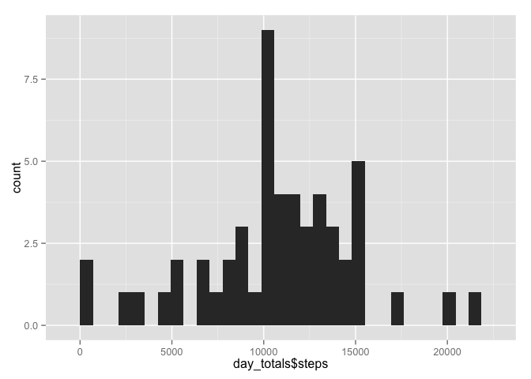
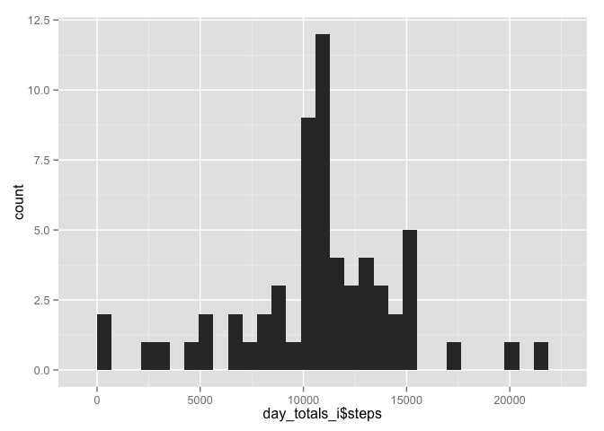

# Reproducible Research: Peer Assessment 1


## Loading and preprocessing the data


```r
library(ggplot2)
library(dplyr)
```

```
## 
## Attaching package: 'dplyr'
## 
## The following objects are masked from 'package:stats':
## 
##     filter, lag
## 
## The following objects are masked from 'package:base':
## 
##     intersect, setdiff, setequal, union
```

```r
unzip('activity.zip')
activity <- read.csv('activity.csv')
activity$date <- as.Date(activity$date)
str(activity)
```

```
## 'data.frame':	17568 obs. of  3 variables:
##  $ steps   : int  NA NA NA NA NA NA NA NA NA NA ...
##  $ date    : Date, format: "2012-10-01" "2012-10-01" ...
##  $ interval: int  0 5 10 15 20 25 30 35 40 45 ...
```

## What is mean total number of steps taken per day?


```r
day_totals<- summarise(group_by(activity, date), sum(steps))
colnames(day_totals) <- c('date', 'steps')

mean(day_totals$steps, na.rm=T)
```

```
## [1] 10766.19
```

```r
median(day_totals$steps, na.rm=T)
```

```
## [1] 10765
```

```r
qplot(day_totals$steps)
```

 

## What is the average daily activity pattern?

```r
imeans <- summarise(group_by(activity, interval), mean(steps, na.rm=T))
colnames(imeans)<- c('interval','steps')

qplot(interval, steps, data=imeans, geom = 'line')
```

 


```r
i1 <- arrange(imeans, desc(steps))[1,]
```
On average across all days, interval #**`835`** contained the highest number of steps, **`206.17`**

## Imputing missing values

How many missing values are there?

```r
sum(is.na(activity$steps))
```

```
## [1] 2304
```

Replace each missing value with the mean value for that time interval, as calculated in the previous step. How do the results change?


```r
imputed <- merge(activity, imeans, by='interval')
imputed[is.na(imputed$steps.x),]$steps.x <- imputed[is.na(imputed$steps.x),]$steps.y
imputed <- imputed[,1:3]
colnames(imputed) <- c('interval','steps','date')

day_totals_i<- summarise(group_by(imputed, date), sum(steps))
colnames(day_totals_i) <- c('date', 'steps')

mean(day_totals_i$steps)
```

```
## [1] 10766.19
```

```r
median(day_totals_i$steps)
```

```
## [1] 10766.19
```


```r
qplot(day_totals_i$steps)
```

 

## Are there differences in activity patterns between weekdays and weekends?

I didn't get to finish this part. :(
